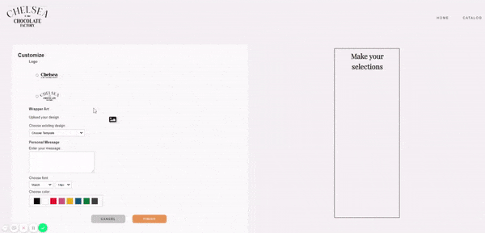
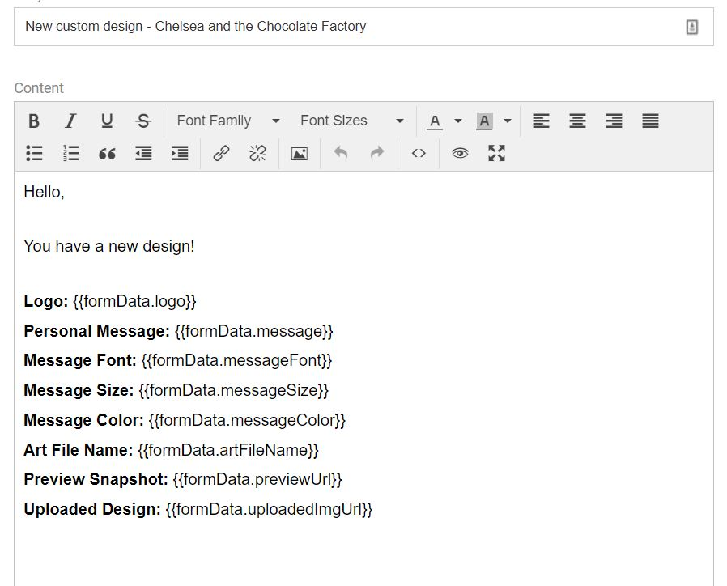
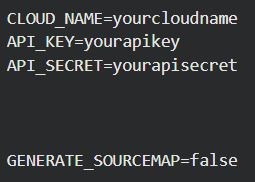
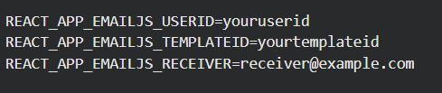

# Chocolate Bar Customizer

## Description

Web application that allows customers to personalize their chocolate bar wrapper. They can choose the logo, the wrapper design, a personal message, font family, and font color. They can see a preview as they make their selections and drag the logo and message around to their desired position. As they checkout, a snapshot of the preview is taken to show the client the positioning the customer chose. All the form information, the url of the uploaded design, and the preview snapshot are sent to the client in an email. 

## Technology

- React
- JavaScript
- Express
- Node
- Sass
- Cloudinary
- Mailgun
- EmailJS

## Demo

## Instructions

- Clone repo
- Create Mailgun, EmailJS, and Cloudinary accounts
- Add Mailgun as a service on EmailJS and input the Mailgun API and domain
- Create email template in EmailJS that contains the following

- Add .env file to root directory that contains the following

- Add .env file to client folder that contains the following

## Contributors

- @stephmarie17
- @alexandramj92
